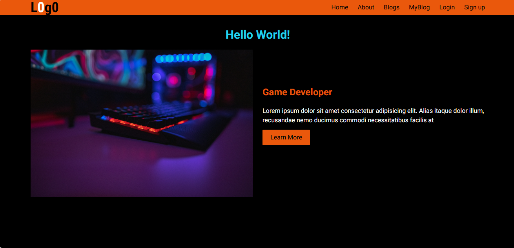
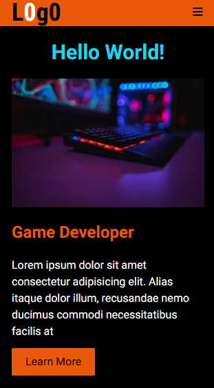

# Game Developer Portfolio Landing Page

A responsive and clean landing page designed to showcase a Game Developer profile. This project focuses on simplicity, readability, and a structured layout suitable for a personal portfolio.

---

## Preview



---

## Features

* Responsive layout for mobile and desktop
* Clean and minimal UI design
* Custom typography using Google Fonts
* Structured layout suitable for a portfolio

---

## Tech Stack

* HTML5
* CSS3 / Tailwind CSS
* Font Awesome (for icons)
* Google Fonts

---

## Project Structure

```bash
Game-developer/
│
├── index.html
├── style.css (or Tailwind setup)
├── assets/
│   └── images/
└── README.md
```

---

## Getting Started

1. Clone the repository:

```bash
git clone https://github.com/Sushara/Game-developer.git
```

2. Open the project:

Open `index.html` in your browser.

---

## Customization

You can update the following based on your needs:

* Profile name and description
* Images and assets
* Fonts and colors
* Layout and sections

---

## Deployment

You can deploy this project using:

* GitHub Pages
* Netlify
* Vercel

---

## Notes

Ensure you have an internet connection for external resources like fonts to load properly.

---

## License

Free to use for personal and educational purposes.